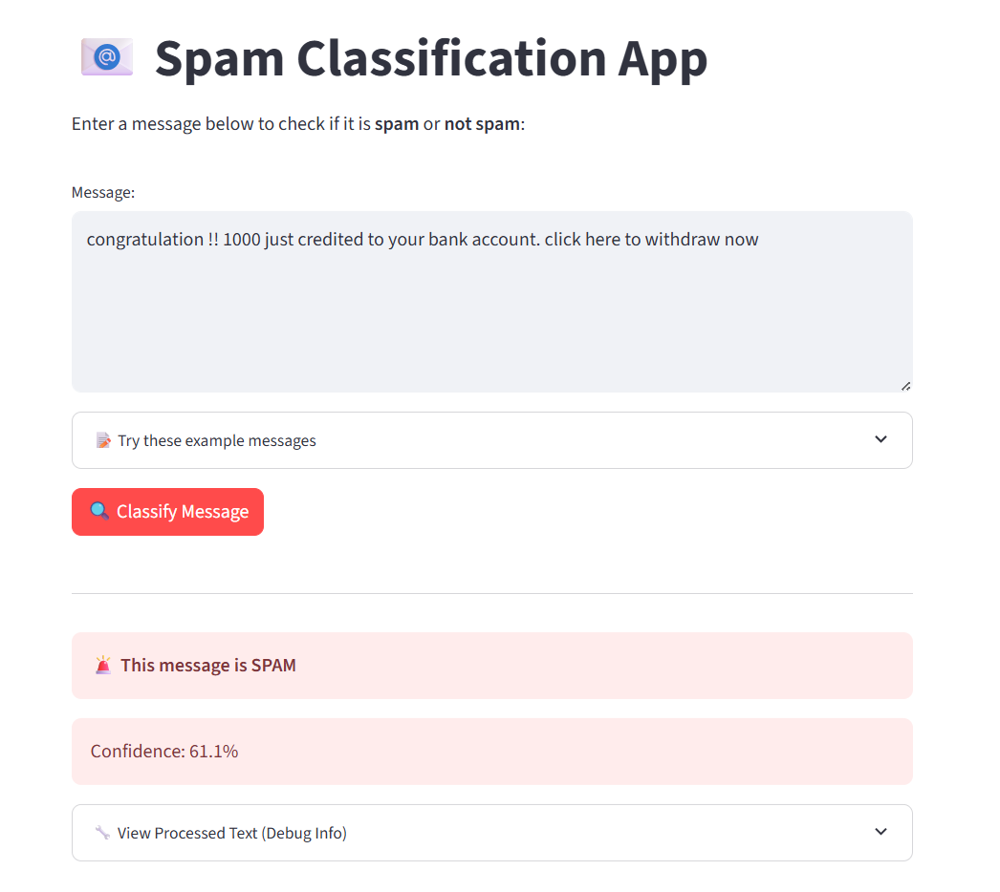
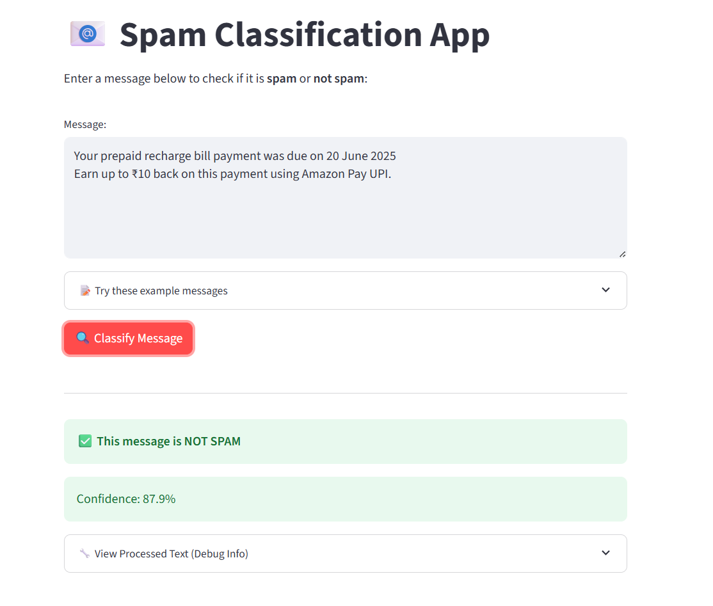

# 📱 SMS Spam Detection

A machine learning project that classifies SMS messages as **Spam** or **Ham (Not Spam)** using NLP techniques and supervised learning algorithms. Achieved **98% accuracy** on the test set.
> 🚀 **Live Demo**: [Click to Try It Out](https://sms-spam-detection-wm8sfldmvfj4yqggupelmv.streamlit.app/)


---

## 📊 Dataset

- **Source**: [Kaggle - SMS Spam Collection Dataset](https://www.kaggle.com/datasets/uciml/sms-spam-collection-dataset)
- **Size**: 5,574 messages
- **Classes**: 
  - `ham`: Non-spam message
  - `spam`: Unwanted promotional or malicious message

---

## ✅ Features

- 98% accuracy using Logistic Regression
- Text preprocessing with NLTK & Scikit-learn
- TF-IDF vectorization
- Confusion matrix, precision, recall, F1-score
- Web app deployment with Streamlit (optional)

---

## 🛠 Installation

1. Clone the repository:

   ```bash
   git clone https://github.com/krishna-Radharani/sms-spam-detection.git
   cd sms-spam-detector

## Screenshot



   
